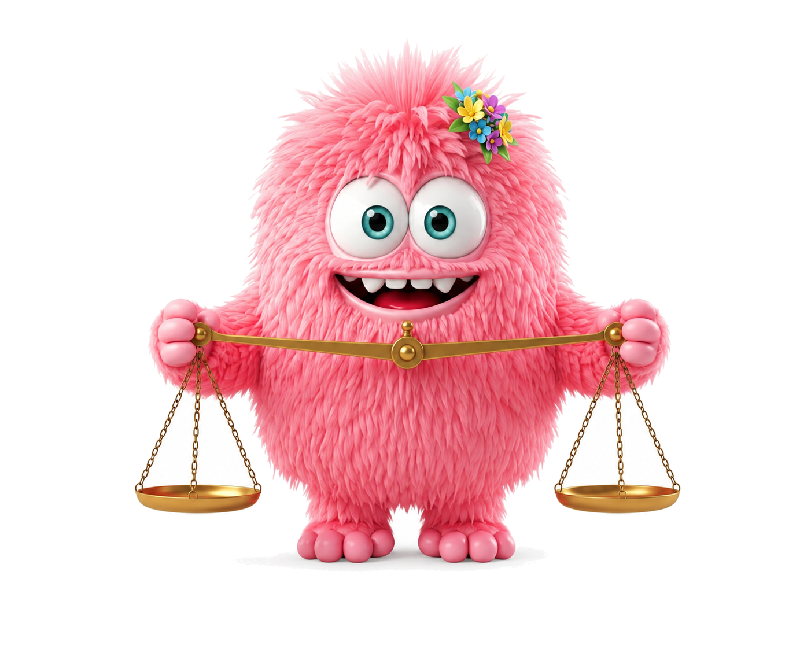

# ARCHITECTURE.md — לומדת "מדעים יעד 3" | סיין 1

## הערה מתודולוגית — מקור האמת בפרויקט הזה
מסמך זה מתעד את **הקוד בפועל** בתיקייה הזו (נבדק ישירות מול `index.html`/
`styles.css`/`script.js` בכל סעיף), לא תיאור תיאורטי. סיבה: בבדיקה מול
`Methodica-science-mass-measure-02-01` (הפרויקט שממנו הועתק מסך 1) התברר
שה-`ARCHITECTURE.md` **של הפרויקט ההוא עצמו** אינו תואם עוד את הקוד שבאמת
נבנה שם בסופו של דבר — לדוגמה, הוא מתעד class names גנריים
(`.select-content`/`.select-head`/`.s0-continue-btn`) וערכי דמות `"blue"`/
`"green"`, בעוד הקוד בפועל (`index.html`/`styles.css`/`script.js` הריאליים)
משתמש ב-`.screen1-content`/`.screen1-text-group`/`.btn-continue` וערכי דמות
`"green"`/`"orange"`. ככל הנראה תועד בשלב תכנון מוקדם ולא עודכן אחרי שינויים
בזמן המימוש. **המסקנה לפרויקט הזה: בכל העתקה עתידית ממסך קיים, לבדוק תמיד את
הקוד עצמו — לא את קובצי ה-`.md` הנלווים אליו — ולוודא שאין override מאוחר
יותר לאותו selector בקובץ המקור (ראו גם הנחיית סקיל `720-templates`).**

## Canvas ומנוע
זהה למוסכמות ב-`מדעים יעד 2` (ראו שם לתיעוד המלא; אומת ישירות מול הקוד כאן):
- קנבס עבודה יחיד: **1280 × 710px**. `#app { width:1280px; height:710px;
  position:absolute; transform-origin:top left }` + `scaleApp()` ב-JS שמתאים
  את הקנבס לגודל ה-viewport (`Math.min(innerWidth/1280, innerHeight/710)`).
- `html, body { direction: rtl; overflow:hidden; font-family:'Assistant', sans-serif }`.
- ניווט מסכים: `.screen { display:none }` → `.screen.active { display:block }`,
  דרך `goTo(n)` / `resetScreenState(n)` / `TOTAL_SCREENS = 7` (בשלב זה).
- `window.lomdaState = { selectedCharacter: savedCharacter || null }` — נטען
  מ-`localStorage.getItem('lomda_selectedCharacter')` באתחול (try/catch —
  חסימת `localStorage` ב-file:///opaque origins לא מפילה את `script.js`).
- Dev postMessage bridge ל-`index_dev.html` (`DEV_READY`/`DEV_GOTO`) — קיים
  ותקין, עדיין לא נבדק עם יותר ממסך אחד.
- טוקני נושא: `--subject-500: #019de5`, `--subject-700: #007ac6` (Science
  theme) — כל צבע תלוי-נושא ממומש כ-`var(--subject-*)`, לא הקסדצימלי מוקשח.

## מסך 1 — TwoOptionSelection (בחירת דמות)

### מקור
העיצוב וה-JS **הועתקו במדויק** (לא מותאמים) ממסך 1 (`data-screen="0"`,
`id="s0"`) של `Methodica-science-mass-measure-02-01`. אין מיפוי Figma frames
למסך הזה — המקור הוא קוד קיים ומאומת, לא קובץ Figma של הפרויקט הנוכחי.
**תמונות הדמות עצמן אינן מהמקור** — סופקו ע"י המשתמשת ספציפית ליחידה זו
(ראו "תמונות הדמות" למטה); רק השלד/CSS/JS הועתקו. שינוי נוסף שהוכנס ביחס
למקור: צבעי `border-color`/`outline` עודכנו מ-HEX מוקשח (`#019DE5`) ל-
`var(--subject-500)`, כדי לעמוד במוסכמת טוקני הנושא שכבר קיימת בתשתית
הפרויקט הזה (ערך זהה בפועל, רק implementation-detail).

### תמונות הדמות
| `data-value` | קובץ | תיאור |
|---|---|---|
| `pink` | `pink-avatar-holds-weight.png` | מפלצת ורודה פרוותית, פרחים בשיער, מחזיקה מאזניים |
| `boy` | `boy-avatar-hold-golds.png` | מפלצת תכולה פרוותית, משקפיים+אוזניות+קפוצ'ון, מחזיקה מטילי זהב |

ה-`data-value` נגזר משמות הקבצים (מוסכמת Companion character system,
`720-templates`) — לא שם "מומצא". לא בוצע נרמול canvas/aspect ratio נוסף
(ראו "Character asset integration" ב-`TwoOptionSelection.md`) — התמונות
כבר עבדו חזותית טוב בתוך `.option-card-img` הקיים; אם יתגלה חוסר איזון
חזותי בין השתיים בבדיקה עתידית, לחזור לסעיף ההוא.

**תיקון רקע (בוצע):** הקבצים שסופקו הגיעו עם רקע לבן אפוי (לא שקוף) —
זה שבר את מצב ה-selected (`#EAF6FF` לא היה נראה מאחורי הדמות, מלבן לבן חד
מסביבה). הוסר רקע הלבן משני הקבצים (flood-fill מבוסס מרחק-צבע מלבן,
`numpy`/`scipy`/`Pillow`, עם feathering + color-decontamination בקצוות
למניעת הילה), ואומת מול רקע `#EAF6FF` ומול המסך האמיתי. **הקבצים
המקוריים עם הרקע הלבן נשמרו** ב-`assets/images/originals/
pink-avatar-holds-weight-original.png` /
`boy-avatar-hold-golds-original.png`, לפי מוסכמת "Keep originals untouched"
מ-`TwoOptionSelection.md` — `assets/images/pink-avatar-holds-weight.png`/
`boy-avatar-hold-golds.png` הם כעת הנגזרות השקופות (production assets).
ראו גם `סיכום-תהליך-בניית-הלומדה.md` סעיף 5 ללקח המלא.

### מבנה (`#s0`) — כפי שקיים בפועל ב-`index.html`
```html
<section class="screen active" data-screen="0" id="s0">
  <div class="screen1-content">
    <div class="screen1-text-group">
      <h1 class="screen1-title">מי תלווה אותנו בלמידה?</h1>
      <p class="screen1-subtitle">בחרו דמות</p>
    </div>
    <div class="options-row" role="radiogroup" aria-label="בחרו דמות">
      <div class="option-card" data-value="pink" role="radio" aria-checked="false"
           tabindex="0" onclick="selectOption(this)" onkeydown="handleCardKey(event, this)">
        <div class="option-card-frame">
          <div class="option-card-img">
            
          </div>
        </div>
      </div>
      <!-- כרטיס "boy" זהה במבנה, data-value="boy", boy-avatar-hold-golds.png -->
    </div>
  </div>
  <div class="bottom-bar">
    <div class="bottom-bar-inner s0-bar">
      <button class="btn-continue" id="s0-continue" disabled onclick="advanceFromS0()">בחרתי</button>
    </div>
  </div>
</section>
```
אין `.option-card-labels` (שם/תיאור) — תואם למקור, ללא טקסט מתחת לכרטיס.
אין כפתור "חזרה" — מסך ראשון ביחידה.

### CSS — נקודות מפתח (`styles.css`, ערכים מדויקים, ללא scale — קנבס 1280×710 ישיר)
- `.screen1-content` — `position:absolute; top:64px; left:235px; width:810px;`
  flex column, `gap:48px` בין קבוצת הטקסט לשורת הכרטיסים.
- `.screen1-title` — 40px/700/`#303030`; `.screen1-subtitle` — 26px/400.
- `.options-row` — flex row, **`direction:ltr`** (`pink` בסלוט הראשון מוצג
  משמאל, `boy` בסלוט השני מוצג מימין — אותו סדר סלוטים פיזי כמו במקור),
  `gap:100px`.
- `.option-card` — רוחב קבוע 296px, ללא תווית.
- `.option-card-frame` — 296px, `border:3px solid rgba(201,206,216,.4)`,
  `border-radius:16px`. Hover/focus/selected → `border-color:var(--subject-500);
  background:#EAF6FF` (משנה רק את המסגרת, לא את התמונה).
- `.option-card-img` — `aspect-ratio:296/278`, `img { object-fit:contain;
  object-position:center bottom; margin-bottom:-30px }` (מיישר את בסיס הדמות
  לתחתית המסגרת, זהה למקור).
- `.s0-bar { justify-content:flex-start }` — במסך הזה בלבד "בחרתי" מיושר
  לצד השמאלי הפיזי של ה-bar (LTR bar), לא כמו ברירת המחדל של שורת הפעולה
  התחתונה הכללית (`.bar-actions` בצד ימין).

### JS — נקודות מפתח (`script.js`)
- `resetScreenState0()` — מסנכרן תמיד את `.selected`/`aria-checked`/`disabled`
  מ-`window.lomdaState.selectedCharacter` (לא "פעם אחת בלבד") — כך שחזרה
  למסך אחרי שינוי בחירה משתקפת נכון.
- `selectOption(cardEl)` — בחירה יחידה; כותב ל-`window.lomdaState.selectedCharacter`
  וגם ל-`localStorage.setItem('lomda_selectedCharacter', …)` בתוך try/catch.
- `handleCardKey(event, cardEl)` — Enter/Space בוחר את הכרטיס הממוקד (a11y,
  `role="radio"`).
- `advanceFromS0()` — `goTo(1)`, guarded (no-op אם אין בחירה; no-op גם אם
  מסך 1 עדיין לא קיים, כי `TOTAL_SCREENS` יגדל רק כשייבנה).

### נבדק בפועל
Playwright headless (ללא project run-skill קיים לפרויקטי 720 — ראו זיכרון
`testing-720-lomda-screens`): רינדור שני הכרטיסים, מעבר בין בחירות, הדגשת
selected (מסגרת+מילוי), הפעלת/השבתת "בחרתי", מקלדת (Enter), פרסיסטנטיות
ב-`localStorage`, ואפס שגיאות JS בקונסול.

## מסכים 2+4 — VideoIntro (כותרת+תיאור+placeholder לסרטון)

**מקור אמת:** Figma **"720 - UI Templates"**, fileKey `eSbp4bKHgBky0rakDb8l9N`,
node `408:4889` ("Video - state 01 - video start") — **לא** לומדת מקור אחרת.
שני המסכים (2: `data-screen="1"`, `id="s1"`; 4: `data-screen="3"`, `id="s3"`)
זהים לחלוטין מבחינת מבנה/CSS — משתמשים באותם class names (`.video-intro-*`),
רק תוכן שונה (מסופק כעת משקפים 4/7 בתסריט ההפקה, ראו "תוכן" למטה).

### מה נלקח מ-Figma (מדויק, לפי `get_design_context`)
- כותרת — `Headings/H-5` (Assistant Bold 40, `#303030`/Natural-800), text-align center.
- תיאור/הוראת צפייה — `Buttons/B-1` (Assistant Regular 26, `#303030`), text-align
  center. (שים לב: זה טוקן שנקרא "Buttons" בספריית העיצוב אך משמש כאן כתת-כותרת —
  לא המצאה, כך זה מתויג בפועל ב-Figma.)
- Player placeholder — 646×363px, `border-radius:16px`, ממורכז. כפתור play
  56×56 עיגול `#303030` + משולש לבן, ממורכז בתוך ה-player.
- עמודת התוכן כולה: `position:absolute; top:64px; left:0; right:0`, flex
  column, `gap:32px` בין הכותרות לנגן.
- פס תחתון: כפתור "להמשיך?" (לא "המשך") **במצב Disabled** בדיוק כפי שמופיע
  בפריים הזה ב-Figma עצמו (`#AEAEAE`, `#303030` — זהה ל-`.btn-continue:disabled`
  הגלובלי שלנו, לא נדרש CSS חדש), + כפתור "חזרה" רגיל.

### מבנה (`#s1`) — כפי שקיים בפועל ב-`index.html` (מסך 2; מסך 4 זהה, תוכן שונה)
```html
<section class="screen" data-screen="1" id="s1">
  <div class="video-intro-content">
    <div class="video-intro-head">
      <h1 class="video-intro-title">האם 3 גרמים של טוּנָה שווים 12 מיליון דולר?</h1>
      <!-- מסך 4 בלבד: <p class="video-intro-subtitle">…</p> -->
    </div>
    <div class="video-player-wrap">
      <div id="s1-yt-player"></div> <!-- YouTube IFrame Player API מחליף את זה ל-iframe -->
    </div>
  </div>
  <div class="char-bubble-wrap">
    <div class="char-speech-bubble"><p>הקשיבו לפודקאסט של נועם ודניאלה וענו בעצמכם...</p></div>
    <div class="char-bubble-avatar"></div>
  </div>
  <div class="bottom-bar">…</div>
</section>
```

### הבדל מודע אחד מ-Figma, לפי בקשה מפורשת
Figma node `408:5243` ("content Flip Cards") הוא ה-sub-node שמכיל גם את
הטקסט+נגן **וגם** toggle "להקשיב לשיחה / להפוך קלפים" (מעבר בין מצב וידאו
למצב כרטיסיות). **רק ה-toggle הוסר** — שאר 408:5243 (כותרת/תיאור/נגן) נשאר
במדויק. אומת ישירות מול `get_design_context` על node 408:5243 בפני עצמו
(לא רק כילד של 408:4889), כדי לוודא בדיוק מה כלול בו.

### החלטות מימוש שדורשות אישור/תשומת לב
1. **רקע ה-placeholder לנגן** — Figma מייצא PNG לוח-שחמט (256×256,
   `imgRectangle522`). **נבנה ב-CSS** (`conic-gradient` דו-גוני) במקום
   הורדת ה-PNG — תבנית גנרית פשוטה, לא תוכן ייחודי, זול יותר לתחזק. אם
   נדרשת התאמה פיקסל-מדויקת לדוגמת ה-PNG המקורי, אפשר לחזור ולהוריד אותו.
2. **כפתור play** — הפיגמה מייצאת אותו כשתי תמונות SVG (עיגול + משולש,
   שתיהן שמורות ב-Figma עם סיומת `.png` בטעות — בדקתי עם `file`, זה בדיוק
   ה-"SVG-as-PNG pitfall" שמוזכר ב-`figma-lomda-builder`). נבנה כ-inline
   SVG במקום ייבוא קובץ — עיגול+משולש הם צורה גיאומטרית פשוטה, תואם
   למוסכמת הפרויקט (אייקוני זום/X כבר inline SVG, לא PNG).
3. **`.flag-btn` (מצאתם בעיה?) — קונפליקט לא-פתור:** ב-Figma frame הזה
   הכפתור ממוקם ב-`top:32px; left:32px`, בעוד ה-`.flag-btn` הגלובלי שלנו
   (מופע יחיד, משותף לכל המסכים, כבר בשימוש במסכים 1+3) ממוקם ב-`top:16px;
   left:16px` — לפי `_global-components.md` וקוד מאומת מהפרויקט הקודם.
   **לא שיניתי את המיקום הגלובלי** (זה ישפיע על כל מסך קיים, לא רק על
   אלה), אבל זה נשאר פער מול ה-Figma הספציפי הזה — דורש החלטה: לשנות
   גלובלית או להשאיר.
4. **בלי video-gating** — כפתור "להמשיך?" קבוע במצב disabled (אין
   `onclick` על כפתור ה-play, אין `<video>` אמיתי) כי עדיין אין קובץ
   וידאו. ברגע שיסופק קובץ, יש לחבר: `s4Start()`-style handler שמחליף
   ל-playing state + `ended` listener שמפעיל את הכפתור, לפי המוסכמה
   הכללית ב-`figma-lomda-builder` ("Video gating").
   ✅ **עודכן (2026-08-11):** הווידאו סופק כקישור YouTube (לא כקובץ
   מקומי) — הוחלט להטמיע דרך YouTube IFrame Player API במקום `<video>`
   מקומי. `.video-player-bg`/`.video-play-btn` הוסרו לגמרי (ה-iframe של
   YouTube מגיע עם ה-thumbnail/play button המובנים שלו). ה-gating עצמו
   מבוסס על `onStateChange` === `YT.PlayerState.ENDED` במקום `ended`
   של `<video>` — ראו `VIDEO_INTRO_PLAYERS` ב-`script.js`.
5. **דמות מלווה + בועת דיבור — נוספו ממקור Figma שני** (סופק בהמשך): קובץ
   "לומדת התנסות" (fileKey `Z9sD0kksYj1Ph1kUcs71sw`), node `2291:11788` —
   קומפוננטה מבודדת (בועה עם זנב + תמונת דמות, בלי קואורדינטות עמוד
   מוחלטות). `.char-bubble-wrap` ממוקם בפינה שמאל-תחתונה (מעל הפס התחתון)
   לפי המוסכמה הגלובלית הקיימת מפרויקטים קודמים ל-widget מהסוג הזה — לא
   הייתה נתונה ב-node עצמו, כך שזו הנחה סבירה, לא ערך שנמדד. הזנב נבנה
   בשני משולשי CSS מוערמים (border-color מאחור, לבן מלפנים) במקום ה-SVG
   המורכב שהפיגמה מייצאת (`imgBubbleText2`, path עם bezier curves) — שקול
   חזותית, קל יותר לתחזוקה. תמונת הדמות מתעדכנת דינמית מ-
   `window.lomdaState.selectedCharacter` (pink/boy) דרך `resolveCharBubbleImg()`
   ב-`script.js`, לפי Companion character system. **עודכן:** נכסי "פוזה"
   ייעודיים לכל מסך סופקו בפועל ע"י המשתמשת — מפת נכסים נפרדת לכל מסך
   (`CHAR_BUBBLE_ASSETS_S1`/`CHAR_BUBBLE_ASSETS_S3` ב-`script.js`, לא מפה
   משותפת אחת), תואם בדיוק לתיאור בתסריט: מסך 2 = "שוקלת 1 טון"
   (`pink/boy-avatar-weighting-1-ton.png`), מסך 4 = "חושבת"
   (`pink/boy-avatar-thinking.png`). **תיקון רקע בוצע גם כאן** — אותו
   pipeline כמו במסך 1 (הקבצים הגיעו RGB אטום, רקע לבן ~254,254,254; הוסר
   עם `numpy`/`scipy`/`Pillow`, אומת ללא הילה מול רקע `#EAF6FF`). המקוריים
   נשמרו ב-`assets/images/originals/*-original.png`.
6. **תוכן — סופק** (שקף 4 למסך 2, שקף 7 למסך 4, מהתסריט). מסך 2: כותרת
   בלבד (הפסקה השנייה בתיבת הטקסט במקור ריקה, בלי תוכן ממשי). מסך 4:
   כותרת+תת-כותרת (שתי פסקאות אמיתיות בתיבת הטקסט). טקסט בועת הדיבור נלקח
   מהצורה הנפרדת "Speech Bubble" בכל שקף (לא מ-"תיבת טקסט 5"). "8–3"/ניקוד
   וכו' הועתקו כלשונם מהשקף, לא תוקנו.

### נבדק בפועל
Playwright headless: ניווט לשני המסכים (`goTo(1)`/`goTo(3)`), `.btn-continue`
disabled כצפוי (תואם ל-Figma), כפתורי חזרה עובדים (מסך 2→1, מסך 4→3),
תוכן כותרת/תת-כותרת/בועה נכון בכל מסך, תמונת הדמות בבועה מתעדכנת נכון עם
מעבר בין pink/boy במסך 1, אפס שגיאות JS. נבדק חזותית — פריסה תואמת
(כותרת+תיאור ממורכזים, נגן 646×363 ממורכז, כפתור play, בועה+דמות בפינה
שמאל-תחתונה, פס תחתון).

### פערים פתוחים שנותרו
- **`.flag-btn`** — קונפליקט מיקום מול ה-Figma הספציפי הזה (32/32 מול
  16/16 הגלובלי) עדיין לא הוכרע.
- **וידאו** — ✅ סגור (2026-08-11). סופק כקישור YouTube ומוטמע דרך
  YouTube IFrame Player API, ראו סעיף 4 למעלה.

## מסך 3 — SingleChoiceQuestion, בלי תמונה

### מקור והתאמות — **תוקן ל-העתקה 1:1 של המבנה**
**גרסה ראשונה (שגויה):** מיקום התוכן (`.scq-noimg-wrap`/`.scq-content-noimg`,
עמודה ממורכזת אנכית+אופקית) הומצא על ידי מבלי לבדוק אם קיים וריאנט "בלי
תמונה" אמיתי בפרויקט המקור. המשתמשת הצביעה על **מסך 14** (`data-screen="13"`,
`id="s13"`) ב-`Methodica-science-mass-measure-02-01` — שאלת בחירה (checkbox,
לא radio) **בלי תמונה** שכבר קיימת ומאומתת שם, ובנויה מ-**אותם class names**
בדיוק כמו מסך 2 (עם תמונה): `.scq-question` → `.scq-content` → `.scq-qtext`
→ `.scq-qtext-body` (מכיל גם `.scq-qtitle` וגם `.scq-qbody` יחד, לא אחים
נפרדים) + `.scq-answers`, **בלי** `.scq-img` בכלל — לא שכבת עטיפה חדשה,
פשוט אותה שורת flex עם ילד יחיד. אומת: אין override נוסף ל-`#s13`/`.scq14-*`
ב-`styles.css` של המקור — ה-CSS הגנרי (`top:139px; left:40; right:40`
וכו') חל כמו שהוא, בלי שינוי, גם בלי תמונה.

**המבנה תוקן להעתקה 1:1** של השלד הזה (מסך 3 שלנו): `.scq-question`
(`top:139px; left:40px; right:40px`, ללא `.scq-img`) → `.scq-content`
(`flex:1`) → `.scq-qtext` (`width:792px`) → `.scq-qtext-body` (כולל qtitle
+qbody יחד) + `.scq-answers` (`width:604px`). זה משאיר במכוון שטח ריק
בצד שמאל (איפה שהתמונה הייתה יושבת אילו הייתה קיימת) — כך זה נראה גם
במקור, ולא "תוקן"/מורכז מחדש. שלוש התאמות תוכן/התנהגות בפועל, לא מבנה:
1. **השאלה נשארת חד-ברירה** (`role="radio"`, לא `role="checkbox"` כמו
   במסך 14 המקורי) — לפי בקשה מפורשת שלא לשנות את סוג השאלה.
2. **שתי `.scq-opt` בלבד** (`data-id="a"`/`"b"`), לא 4 (מסך 2) ולא 4 (מסך 14).
3. **בלי `.scq-opt.correct`/`.wrong`, בלי `#scq-feedbox`, בלי `#scq-check`,
   בלי `#scq-hint`/`#scq-hint-overlay`** — לפי בקשה מפורשת: "לא צריך משוב
   כאן לפי מנגנון המשוב הסטנדטרי" (במסך 14 המקורי יש את כל אלה — לא
   הועתקו). אין שלב בדיקה (`צדקתי?`) בכלל; בחירת אפשרות מפעילה ישירות את
   `.btn-continue` ("המשך").

**לקח:** כשמתבקשת התאמה (כאן: "בלי תמונה") לפני שממציאים פתרון יש לבדוק
אם קיים כבר וריאנט מאומת לאותה התאמה באותו פרויקט מקור — היה קיים (מסך 14),
ורק לא חיפשתי אותו מספיק לעומק בסבב הראשון.

### תוכן (מקור: תסריט הפקה)
`מדעים_יעד 3_שימושי מדידת מסה_להפקה.pptx`, **שקף 6** (חולץ עם `python-pptx`
— טקסט שתי תיבות הטקסט + טקסט שתי הקבוצות + הערת המפיק, ראו
`slide.notes_slide` בקובץ). תוכן מדויק כפי שמופיע בשקף (כולל "8–3 גרם" —
הועתק כלשונו, לא תוקן):
- `.scq-qtitle`: "עזרו לנועם ודניאלה"
- `.scq-qbody`: "האם לדעתכם חוסר של 8–3 גרם במוצר של 142 גרם הוא בעיה חמורה
  שדורשת קנס, או סטייה הגיונית ומותרת?"
- `data-id="a"` (התשובה ה"נכונה" לפי הערת המפיק בשקף — "התשובה הנכונה – א"):
  "אני עם נועם, בעיה חמורה! המפעל צריך לדייק לחלוטין"
- `data-id="b"`: "אני עם דניאלה, מדובר בסטייה הגיונית, במדידות תמיד יש חוסר
  דיוק קטן"

השקף כלל גם שתי תמונות דקורטיביות (`תמונה 1`/`תמונה 3`) — **לא נכללות**
במסך, לפי דרישת "בלי תמונה".

### מבנה (`#s2`) — כפי שקיים בפועל ב-`index.html`, זהה 1:1 למסך 14 המקורי
### (מלבד role/data-id של `.scq-opt` ומספר האפשרויות — ראו התאמות למעלה)
```html
<section class="screen" data-screen="2" id="s2">
  <div class="scq-question">
    <div class="scq-content">
      <div class="scq-qtext">
        <div class="scq-qtext-body">
          <p class="scq-qtitle">עזרו לנועם ודניאלה</p>
          <p class="scq-qbody">האם לדעתכם חוסר של 8–3 גרם במוצר של 142 גרם הוא בעיה חמורה שדורשת קנס, או סטייה הגיונית ומותרת?</p>
        </div>
      </div>
      <div class="scq-answers" role="radiogroup" aria-label="אפשרויות תשובה">
        <div class="scq-opt" role="radio" aria-checked="false" tabindex="0" data-id="a" onclick="s2Select('a')">
          <span class="scq-opt-text">אני עם נועם, בעיה חמורה! המפעל צריך לדייק לחלוטין</span>
          <span class="scq-radio"></span>
        </div>
        <!-- data-id="b" זהה במבנה -->
      </div>
    </div>
  </div>
  <div class="bottom-bar">
    <div class="bottom-bar-inner">
      <div class="bar-actions"><button class="btn-continue" id="s2-continue" disabled onclick="advanceFromS2()">המשך</button></div>
      <div class="bar-back"><button class="btn-back" id="s2-back" onclick="goTo(1)">חזרה</button></div>
    </div>
  </div>
</section>
```
שים לב: `.scq-qtitle`+`.scq-qbody` הם **שני `<p>` אחים בתוך `.scq-qtext-body`
אחד** (לא `.scq-qtitle` כאח נפרד של `.scq-qtext-body`) — תואם 1:1 למקור
(גם מסך 2 עם תמונה, גם מסך 14 בלי תמונה); זו הייתה טעות נוספת בגרסה
הראשונה שתוקנה כאן. גם `.scq-opt` **אין** `onkeydown` (תואם למקור בפועל —
למקור עצמו אין טיפול מקלדת על `.scq-opt` למרות `role="radio" tabindex="0"`;
לא הוספנו מעבר למה שקיים במקור, ראו גם מסך 1 שכן מטפל ב-Enter/Space כי
המקור שלו כן כלל זאת).

### CSS — נקודות מפתח (`styles.css`) — זהה 1:1 למקור (בלי `.scq-img`)
- `.scq-question` — `position:absolute; top:139px; left:40px; right:40px;
  display:flex; flex-direction:row; direction:ltr; align-items:flex-start;
  gap:16px`. בלי `.scq-img`, `.scq-content` (הילד היחיד, `flex:1`) תופס את
  כל הרוחב הפנוי (1200px) — **במכוון לא ממורכז מחדש**, בדיוק כמו במסך 14
  המקורי: השטח שבו הייתה יושבת תמונה (מימין ה-`direction:ltr`, כלומר
  הצד הפיזי השמאלי) נשאר ריק, כי `.scq-content` עצמו מיישר את התוכן שלו
  (`.scq-qtext` 792px / `.scq-answers` 604px) לימין הפיזי (`direction:rtl;
  align-items:flex-start`).
- `.scq-content` — `direction:rtl; display:flex; flex-direction:column;
  align-items:flex-start; gap:24px; flex:1`.
- `.scq-qtext` — `width:792px`; `.scq-answers` — `width:604px` (שני הערכים
  הקבועים מהמקור, לא `width:100%` שהמצאתי בגרסה הראשונה).
- `.scq-qtitle` — 24px/700/`var(--subject-500)`; `.scq-qbody` — 24px/400/`#303030`.
- `.scq-opt` — פיל (`border-radius:999px`), `border:2px solid var(--subject-500)`;
  `.scq-radio` בצד ימין דרך `order:-1`. `.selected` → עיגול כחול מלא
  (`background:var(--subject-500)`) — **אין** מצבי `.correct`/`.wrong` (לא
  רלוונטי, אין בדיקה במסך הזה).
- Bottom bar — ברירת המחדל הגלובלית (`.bar-actions` שמאל-פיזי / `.bar-back`
  ימין-פיזי), בלי override ייעודי כמו `.s0-bar` במסך 1.

### JS — נקודות מפתח (`script.js`)
- `S2 = { correctId: 'a' }` — **מתועד בלבד**, לא נבדק ולא משפיע על ה-UI
  (אין קריאה ל-`S2.correctId` בשום מקום מלבד תיעוד/שימור לעתיד).
- `s2Select(id)` — בחירה יחידה, קורא ל-`resetScreenState2()` לעדכון ה-DOM.
- `resetScreenState2()` — מסנכרן `.selected`/`aria-checked`/`disabled` מ-
  `s2Selected` (משתנה מודול, לא `window.lomdaState` — אין צורך לשמר את
  הבחירה הזו cross-screen/cross-scene, בניגוד לדמות הנלווית).
- `advanceFromS2()` — `goTo(3)`, guarded (no-op אם אין בחירה). מסך 4
  (`data-screen="3"`) קיים כעת ובנוי (VideoIntro, ראו סעיף למעלה) — זה
  מוביל אליו בפועל.
- `resetScreenState(2)` נרשם ב-dispatcher הראשי.

### נבדק בפועל
Playwright headless, כולל אחרי תיקון המבנה ל-1:1: מעבר s0→s1(VideoIntro)→s2
(`window.goTo`), בחירה/החלפת בחירה בין `a`/`b`, `.btn-continue`
disabled↔enabled, resume-state נכון בחזרה מ-`חזרה` וממש דרך `goTo`,
המשך ממסך 3 מוביל בפועל למסך 4 (VideoIntro), אפס שגיאות JS. נבדק חזותית:
התוכן מיושר לימין בתוך עמודת 604/792px, השטח הפנוי בצד שמאל (מקום התמונה
שלא קיימת) נראה כמו במסך 14 המקורי.

## תיקון RTL גלובלי — פס הפעולה התחתון (`.bottom-bar-inner`/`.bar-actions`)
**מה היה:** הפס התחתון (משותף לכל 4 המסכים) השתמש ב-`direction: ltr` על
`.bottom-bar-inner` ו-`.bar-actions` כדי לקבע את כפתור ה"המשך/בחרתי" בצד
שמאל פיזי וה"חזרה" בצד ימין — טכניקה שהועתקה 1:1 מהקוד המאומת של הפרויקט
הקודם. זה **לא** גרם לבאג חזותי נראה לעין (טקסט עברית מציג נכון בכל מקרה
בזכות ה-Unicode bidi ברמת התו), אבל המשתמשת ביקשה במפורש שכל הלומדה כולל
כל הכפתורים יהיו RTL אמיתי — לא טריק היפוך direction.

**התיקון:** הוסר `direction: ltr` לגמרי מ-`.bottom-bar-inner` ומ-`.bar-actions`.
במקום זאת, הסדר הפיזי (חזרה מימין, המשך/הבא משמאל) מושג ע"י **סדר ה-DOM
בפועל**: `.bar-back` מופיע לפני `.bar-actions` בכל מסך (בקונטיינר RTL,
הילד הראשון = `flex-start` = ימין; הילד השני = `flex-end` = שמאל) —
תוצאה חזותית זהה, בלי לגעת ב-`direction`. עודכן ב-`index.html` בכל
המסכים (1,2,3,4). מסך 1 (`s0-bar`, כפתור "בחרתי" יחיד) עודכן בנפרד:
`justify-content: flex-end` (= שמאל ב-RTL), עם selector מורכב
(`.bottom-bar-inner.s0-bar`) כדי לנצח את `.bottom-bar-inner`'s
`justify-content: space-between` בלי תלות בסדר ההופעה בקובץ CSS (אותה
specificity אחרת — זו הייתה תקלה נוספת שנחשפה תוך כדי התיקון: הראשונית
`.s0-bar { justify-content: flex-end }` לא תפסה בגלל סדר ה-cascade).

**מה נשאר `direction: ltr` ולמה (בכוונה, לא שכחה):**
- `.options-row` (מסך 1, שורת כרטיסי הדמות) — בלי טקסט חי בפנים (רק
  תמונות), אין סיכון bidi; שינוי סדר ה-DOM שם היה משנה גם את סדר ה-Tab
  במקלדת (pink↔boy) בלי תועלת אמיתית. הושאר כפי שהועתק מהמקור המאומת.
- `.scq-question` (מסך 3) — `.scq-content` הפנימי כבר מאפס בחזרה
  ל-`direction: rtl` באופן מפורש (כך גם במקור המאומת) — הטקסט בפועל
  תמיד RTL; ה-LTR החיצוני משמש רק למיקום "המקום שבו הייתה יושבת תמונה"
  ולא עוטף טקסט ישירות.
- שני המקרים אומתו כלא-מסוכנים (בלי טקסט/כפתורים בתוכם ישירות תחת
  ה-LTR), בניגוד לפס התחתון שעטף כפתורים אמיתיים.

**לקח:** גם כשטכניקת "היפוך direction" מועתקת נאמנה ממקור מאומת, וגם
כשאין באג חזותי נראה לעין (כי Unicode bidi "מציל" טקסט עברי גם בתוך
direction:ltr), זה עדיין נחשב לא-RTL-אמיתי מבחינת המשתמשת — יש להעדיף
פתרון מבוסס סדר-DOM/flex-end במקום היפוך direction, בכל מקום שעוטף
כפתורים/טקסט חי, אלא אם יש סיבה ספציפית מתועדת (כמו `.scq-content`
שמאפס בחזרה ל-RTL באופן מפורש).

## מסך 5 — בחירת מסלול למידה (TwoOptionSelection)

### מקור ו-reuse ממסך 1
Figma "לומדת התנסות" (fileKey `Z9sD0kksYj1Ph1kUcs71sw`), node `196:3215`
("TwoOptionSelection") — אותה תבנית גנרית שכבר מומשה במסך 1. נבדק ישירות
מול `get_design_context` על הפריים הזה: עמודת התוכן (`left:calc(16.67%+21.67px)
top:64px w:810px` ≈ `left:235px` בקנבס 1280 — זהה למספרים ש-`.screen1-content`
כבר משתמש בהם), וגודל כרטיס (`296px` חיצוני) — **reuse מלא, בלי CSS חדש**:
`.screen1-content`/`.screen1-text-group`/`.screen1-title`/`.screen1-subtitle`
ו-`.option-card`/`.option-card-frame`/`.option-card-img` משמשים כמו שהם.

שתי התאמות **scoped ל-`#s4` בלבד** (לא נוגעות במסך 1):
1. **תווית שם מתחת לכל כרטיס** (`.option-card-label`, bold 32 per Figma) —
   מסך 1 בכוונה בלי תוויות (הועתק כך מהמקור, "ללא labels/names"); מסך 5
   כן צריך תוויות ("תרופות"/"זהב"), אז נוספה מחלקה חדשה (לא משנה את
   `.option-card` הבסיסי, רק מוסיפה `gap:12px` שאין לו השפעה על מסך 1
   שיש בו ילד יחיד).
2. **`object-fit: cover` על תמונות ה-JPG** (לא `contain` כמו הדמויות
   במסך 1) — אלה תצלומי מוצר מלאי-פריים (1254×1254, כמעט מרובע), לא
   דמויות שצריך לשמר במלואן; `cover` תואם את ה-Figma (`object-cover`
   בקוד שיוצא) ומייצר חיתוך זניח (יחס 296:278 מול תמונה מרובעת 1:1).

### מיקום ימין/שמאל — נמדד, לא נוחש
תסריט ההפקה (שקף 9) לא מציין איזה תחום מימין/משמאל ("שם התמונה בצד ימין:
<יש להעתיק...>" — placeholder ריק). נמדדו **מיקומי X בפועל של הצורות
ב-PPTX המקורי** (`python-pptx`, `shape.left`): "תרופות"/`Picture 15`
ב-`x=6.80in` מתוך רוחב שקף `13.33in` (חצי ימני) מול "זהב"/`Picture 8`
ב-`x=2.93in` (חצי שמאלי). כפתור "בחרתי" נמדד ב-`x=0.29in` (קרוב לקצה
שמאל) וכפתור "חזרה" ב-`x=11.20in` (קרוב לקצה ימין) — מאמת שוב את מוסכמת
ה-RTL שכבר קבועה (המשך=שמאל, חזרה=ימין).

**מומש כ-RTL טהור, בלי `direction:ltr`** — לפי הכלל שנקבע בתיקון ה-RTL
הגלובלי (ראו סעיף למעלה): `.options-row.s4-options-row { direction: rtl;
gap: 24px }` (selector מורכב, מנצח את `.options-row` הבסיסי `direction:ltr`
בלי תלות בסדר קובץ). "תרופות" הוא הילד **הראשון** ב-DOM (=ימין תחת RTL),
"זהב" שני (=שמאל) — בלי שום היפוך כיוון, רק סדר DOM נכון.

### תוכן (מקור: תסריט הפקה, שקף 9)
- כותרת: "מדידות בחיי היום יום"
- תת-כותרת: "בחרו אחד משני התחומים הבאים כדי ללמוד:"
- תווית כרטיס 1: "תרופות" (`data-value="medicine"`, `screen5-midicine.jpg`)
- תווית כרטיס 2: "זהב" (`data-value="gold"`, `screen5-gold-blocks.jpg`)
- כפתור המשך: "בחרתי" (תואם למסך 1, לא "להמשיך?"/"שנמשיך" כמו במסכי
  ה-VideoIntro — כי זה בדיוק הטקסט שמופיע בפועל ב-Figma של הפריים הזה).
- שתי תמונות ה-JPG (מוצרי תרופות / מטילי זהב ומטבעות) כבר RGB רגיל, לא
  זקוקות להסרת רקע — תצלום מלא-פריים על רקע לבן, לא character cutout.

### JS
- `s4SelectedPath` (משתנה מודול, `'medicine'`/`'gold'`) — לא ב-`window.lomdaState`,
  כי זו בחירת מסלול לימודי, לא זהות דמות (לפי הכלל המפורש ב-Companion
  character system: "Learning-path selection and character selection are
  separate state concerns").
- `advanceFromS4()` — מנתב לפי הבחירה. **עודכן** לאחר שנבנה תוכן מסכים 6+7:
  `gold → goTo(5)`, `medicine → goTo(6)` — **הפוך** מהניתוב המקורי
  (`medicine→5`/`gold→6`) שנקבע כשמסך 5 נבנה, לפני שהתברר איזה תוכן שייך
  לאיזה מסך. הסיבה לשינוי: תוכן שקפים 10–12 (מסך 6) מתויג במפורש "זהב"
  בטקסט השקף עצמו, ושקפים 13–15 (מסך 7) מתויגים "תרופות" — ראו סעיף
  "מסכים 6+7" למטה. **דורש אישור מהמשתמשת** שזה אכן הכיוון הנכון (ראו
  קובץ הסיכום).
- `handleS4CardKey` — נפרד מ-`handleCardKey` הגלובלי (זה של מסך 1 קורא
  ל-`selectOption` באופן מוקשח) — לא שונה קוד משותף, נוספה פונקציה
  ייעודית במקום.

### נבדק בפועל
Playwright: מיקום פיזי (medicine.x > gold.x, כלומר medicine מימין),
בחירה/החלפת בחירה, `.btn-continue` disabled↔enabled, ניתוב בפועל למסכים
6/7 (קיימים כעת), כפתור חזרה מוביל למסך 4, אפס שגיאות JS. נבדק חזותית
מול screenshot — תואם לפריסת ה-Figma.

## מסכים 6+7 — סימולציה (placeholder) + ValueInputQuestion, בלי רמז, עם משוב

### מקור
מבנה מפוצל (placeholder סימולציה משמאל + פאנל שאלה מימין) הועתק **1:1**
מהקוד האמיתי של מסך 3 (`data-screen="2"`, `id="s2"`) ב-
`Methodica-science-mass-measure-02-05` — `.dq-sim-placeholder` (427×636,
`#c4c4c4`), `.dq-question-panel` (`left:427px`, `padding:83px 40px 16px 0`,
`overflow-y:auto`), `.dq-part-badge`, `.dq-instruction-bold`, `.dq-sentence`/
`.dq-snt-pre`/`.dq-snt-post`, ו-`.scq-fb-box.dq-feedbox-pos`
(`left:341px; bottom:87px; width:400px`) — כל הערכים נבדקו ישירות מול
`styles.css` של הפרויקט ההוא, לא נוחשו. שם זו הייתה שאלת גרירה
(DragAndDropQuestion); כאן, לפי בקשה מפורשת, זו שאלת קלט מספרי
(ValueInputQuestion), Figma "לומדת התנסות" (fileKey `Z9sD0kksYj1Ph1kUcs71sw`):
node `196:3341` (ברירת מחדל) / `196:3381` (פוקוס) / `196:3405` (משוב שגוי,
border `#B20010`) / `196:3397` (משוב נכון, border `#609E12`). הפריים
הגנרי כולל גם "question nav" (breadcrumb 6 שאלות) ו"אפשר רמז?" — **שניהם
לא נלקחו**: ה-nav לא רלוונטי (רק 2 מסכים, לא 6), הרמז הוסר לפי בקשה
מפורשת. `.viq-input` הוא ה-CSS היחיד שבאמת נוסף מאפס: הפיגמה מייצאת את
תיבת הקלט כ-`<button>`/`<div>` מעוצב (סטטי, ל-mockup); כאן זה `<input>`
אמיתי (סמנטיקה נכונה, מקלדת מספרית) באותם מידות/צבעים בדיוק
(180×42, `border-radius:10px`, `border:1px solid rgba(174,174,174,.5)` —
זהה גם ל-`.dq-snt-drop` הקיים בפרויקט המקור לאותו תפקיד חזותי).

### פירוש שקפי התסריט — 3 שקפים = 3 מצבים של מסך אחד, לא 3 מסכים
שקפים 10/11/12 (מסך 6) ו-13/14/15 (מסך 7) הם כל אחד **אותו מסך בשלושה
מצבים** (ברירת מחדל / משוב שגוי / משוב נכון) — לא שישה מסכים נפרדים.
ההערות (`notes_slide`) חוזרות מילה-במילה בכל שישת השקפים (גם כש"התשובה
הנכונה" משתנה בפועל בין 0.1 ל-0.037!), מה שמאשר שאלה הערות boilerplate
כלליות ולא ספציפיות-שקף — בהתאמה לאזהרת המשתמשת ("בשקפים זה לא מסודר").

**הקפדה על הפרדת סימולציה/שאלה:** כל שישה השקפים מכילים גם את תוכן
הסימולציה (תמונות "מאזניים רגילים"/"מאזניים רגישים", קריאות "00.00",
תמונת המוצר) יחד עם תוכן השאלה עצמה, **באותו שקף**. **רק** הטקסט הבא
נלקח לפאנל הימני (השאלה); כל השאר (תמונות/קריאות המאזניים) שייך לסימולציה
ולא נכלל בכלל, לפי בקשה מפורשת:
- Badge: "זהב" (מסך 6) / "תרופות" (מסך 7)
- הוראה (bold): "לפניכם שני סוגי מאזניים: מאזניים רגילים ומאזניים רגישים
  במיוחד.<br>שימו את הזהב/התרופה על כל אחד מהמאזניים ותעדו את הפער ביניהם."
- שאלת הקלט: "מהו הפער שקיבלתם? **[קלט]** גרם"
- משוב נכון (משותף לשני המסכים, לפי "shared explanation" convention):
  כותרת "נכון!", גוף "מדובר בפער קטן, עד כמה לדעתכם הוא משמעותי?"
- משוב שגוי סופי (משותף): כותרת "זו טעות. התשובה הנכונה מוצגת.", **אותו
  גוף** כמו המשוב הנכון (תואם ל-`_question-template-defaults.md` → "שיתוף
  גוף ההסבר בין נכון/שגוי-סופי").
- משוב שגוי ראשון (ניסיון 1/2, `maxAttempts:2`): **לא סופק בתסריט** (הוא
  הניח ניסיון אחד בלבד) — נעשה שימוש בברירת המחדל המתועדת ב-
  `ValueInputQuestion.md` עצמו: כותרת "התשובה אינה נכונה.", גוף "נסו שוב."

### ✅ מספר ניסיונות — אושר (2026-07-13)
התסריט אומר בהערות "ניסיון מענה אחד" (1 ניסיון), אבל המשתמשת אישרה
במפורש (פעמיים) ששתי ניסיונות הוא הנכון. `VIQ_SCREENS`/`viqCheck` ב-
`script.js` נשארים כפי שהם (2 ניסיונות).

### ✅ ניתוב מסך 5 — אושר (2026-07-13)
ניתוב `gold→6`/`medicine→7` (תואם לתיוג בפועל של תוכן השקפים) אושר על
ידי המשתמשת — היא ציינה שסדר הבנייה בין המסכים לא משנה, העיקר שהניתוב
עצמו נכון ועקבי. אין צורך בשינוי.

### תוכן — ערכים נכונים
- מסך 6 (זהב): `0.1` גרם (מאזניים רגישים 10.00 פחות מאזניים רגילים 9.9).
- מסך 7 (תרופות): `0.037` גרם (מאזניים רגישים 2.037 פחות מאזניים רגילים 2.00).

### JS — נקודות מפתח (`script.js`)
- `VIQ_SCREENS` — קונפיג משותף לשני המסכים (`correct`, `inputId`,
  `checkBtnId`, `feedboxId`, `nextScreen`), מפתח לפי `data-screen`. לוגיקה
  אחת גנרית (`viqCheck`/`viqOnInput`/`viqFinish`/`resetScreenStateViq`)
  במקום לשכפל אותו קוד פעמיים — התוכן/הערך הנכון בלבד שונה.
- `viqOnInput(n)` — עריכה חוזרת מנקה `.error` ומסתירה משוב, לפי אותה
  מוסכמה כמו `scqSelect` במסך 3 ("clears a prior wrong attempt's marks").
- `viqCheck(n)` — נכון→`.correct`+נעילה+סיום; שגוי ראשון (מתוך 2)→`.error`+
  משוב+מותר לתקן; שגוי אחרון→חושף ערך נכון+`.wrong`+נעילה+סיום.
- `viqFinish(n)` — כפתור→"המשך" (לא "שנמשיך?" — SingleChoiceQuestion.md
  ו-ValueInputQuestion.md מתעדים תוויות שונות במפורש), `viqCheck` שוב
  אחרי סיום פשוט מנתב ל-`nextScreen`.
- **בלי `.btn-hint` בכלל** במסכים האלה — לא רק hidden, ממש לא קיים ב-DOM
  (לפי בקשה מפורשת "בלי כפתור אפשר רמז").
- `resetScreenStateViq(n)` — resume-state guard רגיל (`if (viqDone[n]) return`).
- `scqFbMakeDraggable('s5-feedbox')`/`('s6-feedbox')` נקראות פעם אחת
  ב-init (תחתית הקובץ), לפי מוסכמת "Feedback popup system".

### נבדק בפועל
Playwright: ניתוב gold→מסך6/medicine→מסך7, אין `.btn-hint` בשני המסכים,
ניסיון שגוי ראשון (משוב אדום + `.error`, מתאפשר תיקון), עריכה חוזרת
מנקה משוב, ניסיון שגוי אחרון (חושף ערך נכון, נועל, "המשך"), תשובה נכונה
בניסיון ראשון (ירוק, נועל, "המשך"), resume-state נכון בחזרה למסך שהושלם,
"המשך" מנווט ל-`nextScreen`, כפתור חזרה עובד, אפס שגיאות JS. נבדק חזותית —
הפריסה המפוצלת ומיקום פאנל המשוב תואמים למקור.

## רכיבים גלובליים כבר בתשתית (`_global-components.md`) — מוכנים, טרם מחוברים לתוכן
זהה למה שמתועד ב-`סיכום-תהליך-בניית-הלומדה.md` סעיף 3: `.flag-btn`,
`.img-zoom-btn`/`#img-zoom-modal`, פופ-אפ משוב גריר (`.scq-fb-*`), פופ-אפ רמז
(CSS בלבד, `.scq-hint-*`), `.btn-continue`/`.btn-back`/`.btn-hint`,
`.transition-content`/`.transition-avatar`. לא חוזר כאן במלואו כדי לא לשכפל
תיעוד — עדכונים לרכיבים האלה נכנסים לקובץ הסיכום ברמת היחידה, לא לכאן.

## רשימת Assets בפועל (`assets/images/`)
| קובץ | מקור | הערה |
|---|---|---|
| `pink-avatar-holds-weight.png` | סופק ע"י המשתמשת, **רקע הוסר** (ראו סעיף מסך 1) | דמות סופית, `data-value="pink"` |
| `boy-avatar-hold-golds.png` | סופק ע"י המשתמשת, **רקע הוסר** | דמות סופית, `data-value="boy"` |
| `pink-avatar-weighting-1-ton.png` / `boy-avatar-weighting-1-ton.png` | סופק ע"י המשתמשת, **רקע הוסר** | פוזת בועה למסך 2 (`CHAR_BUBBLE_ASSETS_S1`) |
| `pink-avatar-thinking.png` / `boy-avatar-thinking.png` | סופק ע"י המשתמשת, **רקע הוסר** | פוזת בועה למסך 4 (`CHAR_BUBBLE_ASSETS_S3`) |
| `pink-avatar-warming-up.png` / `boy-avatar-warming-up.png` | סופק ע"י המשתמשת, **רקע הוסר** | פוזת "חימום" למסך 10 (`S9_AVATAR_ASSETS`) — ממתין להחלפה בגיף אנימציה |
| `btn-flag-default.png` / `btn-flag-hover.png` | הועתק (רכיב `.flag-btn` גלובלי) | קבוע — לא תלוי-דמות |
| `icon-hint-blue.svg` | הועתק (CSS-only hint popup) | קבוע |
| `assistant-hebrew.woff2` / `assistant-latin.woff2` | הועתק (עותק מקומי לסין, ראו מוסכמת assets בסעיף הבא) | קבוע |
| `originals/*-original.png` (8 קבצים: holds-weight/hold-golds/weighting-1-ton×2/thinking×2/warming-up×2) | הקבצים המקוריים כפי שסופקו (רקע לבן אפוי) | **archival בלבד — לא נטענים בקוד**, נשמרו לפי מוסכמת "Keep originals untouched" |
| `screen5-midicine.jpg` / `screen5-gold-blocks.jpg` | סופק ע"י המשתמשת | תצלום מוצר מלא-פריים, `object-fit:cover`, **בלי** הסרת רקע (לא character cutout) |

(`avatar-green-selected.png`/`avatar-orange-selected.png` — עותקי ה-placeholder
הזמניים מהפרויקט הקודם — הוסרו מהתיקייה לאחר ההחלפה בתמונות הסופיות.)

## מבנה נכסים — עצמאות מלאה לכל סין
זהה למוסכמה שאומתה ב-`מדעים יעד 2` (ראו `סיכום-תהליך-בניית-הלומדה.md` סעיף 2):
`assets/fonts,images,videos` **בתוך תיקיית הסיין עצמה**, לא תיקיית assets
משותפת ברמת הפרויקט הראשי — כל סין הוא חבילה עצמאית הניתנת להעלאה בנפרד ל-LMS.

## סדר בנייה — עד כה
1. שלד קבצים + מנוע גלובלי + רכיבים גלובליים גנריים (סעיף 3 בקובץ הסיכום). ✅
2. מסך 1 (TwoOptionSelection) — הועתק במדויק, מבנה+CSS+JS, נבדק ב-Playwright. ✅
3. `PROJECT_BRIEF.md` / `ARCHITECTURE.md` — נוצרו רטרואקטיבית (אחרי מסך 1),
   לפי המוסכמה המחייבת שנקבעה ב-`מדעים יעד 2`. ✅
4. תמונות דמות סופיות (pink/boy) הוטמעו במסך 1, כולל תיקון רקע. ✅
5. מסך 2 — נבנה בהתחלה כ-placeholder ריק בכוונה, **הפך מאוחר יותר ל-VideoIntro**
   (ראו סעיף 8) כשסופקו Figma+תוכן. ✅
6. מסך 3 (SingleChoiceQuestion, בלי תמונה, 2 אפשרויות, בלי משוב) — הותאם
   ממסך 2 של הפרויקט הקודם, תוכן משקף 6 בתסריט ההפקה. נבדק ב-Playwright. ✅
7. מסך 4 — נבנה בהתחלה כ-placeholder ריק, גם הוא הפך ל-VideoIntro. ✅
8. מסכים 2+4 (VideoIntro) — נבנו לפי Figma node 408:4889, תוכן משקפים 4/7,
   דמות+בועה לפי Figma node 2291:11788, פוזות ייעודיות (weighting-1-ton/
   thinking). ✅
9. תיקון RTL גלובלי בפס הפעולה התחתון (בלי `direction:ltr`). ✅
10. מסך 5 (TwoOptionSelection — בחירת מסלול תרופות/זהב) — reuse ממסך 1,
    תוכן משקף 9, ניתוב למסכים 6/7 (טרם קיימים בזמנו). ✅
11. מסכים 6+7 (placeholder סימולציה + ValueInputQuestion, בלי רמז, עם
    משוב, 2 ניסיונות) — מבנה מפוצל 1:1 ממסך 3 ב-`...-02-05`, תוכן
    משקפים 10-12/13-15, ניתוב מסך 5 ומספר הניסיונות אושרו ע"י המשתמשת
    (2026-07-13). ✅
12. מסך 8 (`data-screen="7"`, `id="s7"`) — VideoIntro, מבנה זהה למסך 4
    (`id="s3"`) אך **בלי** `.char-bubble-wrap` (בלי דמות/בועית, לפי בקשה
    מפורשת). תוכן: תסריט הפקה שקף 16. נקודת התכנסות של שני מסלולי הלמידה
    (מסכים 6+7) — תוקן `VIQ_SCREENS[5].nextScreen`/`[6].nextScreen` שניהם
    ל-`7` (באג: היה `5→6` כלומר מסלול "זהב" היה ממשיך בטעות למסך
    "תרופות" במקום להתכנס למסך 8 — תוקן תוך כדי בניית המסך הזה). כפתור
    "חזרה" חוזר ל-`goTo(4)` (מסך הבחירה), עקבי עם התקדים ב-מסכים 6+7.
    `resetScreenState7()` הוא no-op כרגע — hook עקבי ל-video-gating עתידי.
    נבדק ב-Playwright — שני המסלולים (זהב/תרופות) מתכנסים נכון למסך 8,
    בלי דמות/בועית, ללא שגיאות JS. ✅
13. מסך 9 (`data-screen="8"`, `id="s8"`) — SingleChoiceQuestion **עם תמונה**
    (`.scq-img`/`.scq-img-inner`), הועתק 1:1 ממסך 2 (`id="s1"`) של
    `Methodica-science-mass-measure-02-01`. 2 ניסיונות, כפתור "אפשר רמז?"
    (גלוי מההתחלה — המקור לא סטה מברירת המחדל), משוב
    correct/wrong1/wrong2 (wrong2 וcorrect חולקים גוף זהה, שונים רק
    בכותרת — לפי מוסכמת "שיתוף גוף ההסבר"). תוכן: תסריט הפקה, שקפים
    18-22 (5 שקפים = 5 מצבים של אותו מסך אחד: לפני/משוב שגוי1/רמז/משוב
    שגוי סופי/משוב נכון). תמונת השאלה סופקה ע"י המשתמשת
    (`מסך9-מדידה במאזניים הקניה.png`, 1254×1254 ריבועי — `object-fit:cover`
    תואם למקור). נוספו לפרויקט: `icon-check-white.png`, `icon-x-white.png`,
    `icon-idea-white-lg.svg` (מהמקור) + CSS חדש ל-`.scq-img`/`.scq-opt.
    correct/.wrong/.disabled`/`.scq-radio::after`/`.scq-hint-icon` (לא היו
    קיימים בפרויקט — מסך 3 הקודם היה וריאנט-בלי-תמונה-ובלי-משוב בלבד).
    `.scq-hint-overlay`/`.scq-hint-popup` הגלובליים כבר היו קיימים (נבנו
    אך לא נוצלו קודם) ונוצלו כאן בפעם הראשונה.
    ✅ **correctId אושר (2026-07-13):** הערת המפיק בשקף 18 אמרה "התשובה
    הנכונה – א", אך תוכן המשוב הנכון/שגוי-סופי (שקפים 21-22) מתאר במפורש
    את שיטת "לבצע כמה מדידות ולחשב את הממוצע" (אפשרות ב) כתשובה הנכונה,
    ומיקום איקון ה-"i" הגרפי בשקף 21 גם הוא צמוד לאפשרות ב. המשתמשת
    אישרה ש-ב היא התשובה הנכונה — `S8.correctId = 'b'` נשאר כפי שהוא,
    ללא צורך בשינוי.
    נבדק ב-Playwright — תמונה נטענת, רמז נפתח/נסגר, ניסיון שגוי→משוב→
    ניסיון שגוי סופי חושף את האפשרות הנכונה, תשובה נכונה בניסיון ראשון,
    resume-state, בחירה במקלדת (Enter), ניווט, ללא שגיאות JS.
14. מסך 10 (`data-screen="9"`, `id="s9"`) — מסך מעבר עם דמות מלווה, הועתק
    1:1 ממסך 6 (`data-screen="5"`, `id="s5"`) של
    `Methodica-science-mass-measure-02-01`. **חשוב:** זה וריאנט שונה
    מה-`.transition-content`/`.transition-avatar` שנשמר בפרויקט מוקדם
    יותר "לשימוש עתידי" (`styles.css` שורה ~574) — אותו בלוק שייך לוריאנט
    "5 שאלות" ממסך אחר לגמרי באותו פרויקט מקור, ולא הותאם כאן; נבנה בלוק
    CSS חדש (`.s9-content`/`.s9-message`/`.s9-instructions`/`.s9-avatar`)
    לפי המקור הנכון בפועל, לפי כלל "לחפש במקור לפני שממציאים". תוכן:
    תסריט הפקה, שקף 23 ("מה נשאר לנו בראש?" / "שתי שאלות קלילות לחימום
    לפני שנתקדם"). כפתור ההמשך נושא תווית ייעודית מהשקף ("אפשר להתחיל!"),
    לא "המשך" הגנרי — דרש override נקודתי ל-`#s9-continue`
    (`width:auto; min-width:140px`) כי הטקסט הארוך גלש מ-140px הקבוע של
    `.btn-continue` הגלובלי (נמדד: scrollWidth 152px).
    **✅ עודכן (2026-07-13): פוזת "חימום" ייעודית סופקה** — הוחלף
    ה-placeholder הזמני (תמונות מסך 1) בפוזות ייעודיות
    `pink-avatar-warming-up.png`/`boy-avatar-warming-up.png` (סופקו ע"י
    המשתמשת, 1254×1254 כל אחת, רקע לבן אחיד — הוסר באותה שיטת flood-fill/
    feathering/decontamination כמו שאר תמונות הדמות; מקור גובה נשמר
    ב-`originals/*-warming-up-original.png`). נבחרות דינמית לפי
    `window.lomdaState.selectedCharacter` (Companion character system).
    מאחר ששתי הפוזות החדשות באותו יחס-רוחב/גובה בדיוק (ריבועי), `.s9-avatar`
    חזר ל-`aspect-ratio:304/293`/`object-fit:cover`/`border-radius:16px`
    המדויקים של המקור (`.s6-avatar`) — לא עוד `contain` בתיבה, שהיה נחוץ
    רק כשהיו שתי תמונות placeholder ביחסים שונים. גיף אנימציה (שקף 23:
    "הגיף שנבחר בעמוד הראשון עושה תנועת חימום של כושר") טרם סופק — עדיין
    ממתין, ה-`` הסטטי ישאר עד שיסופק.
    נבדק ב-Playwright — הודעה/הוראות/תווית כפתור נכונים, שתי הדמויות
    (pink/boy) נטענות נכון עם הפוזות החדשות, ניווט קדימה/אחורה, ללא
    שגיאות JS.
15. מסכים 11+12 (`data-screen="10"`/`"11"`, `id="s10"`/`"s11"`) — 2 שאלות
    חימום המלוות בסרגל התקדמות משותף (qnav): 2 ניסיונות לכל שאלה, כפתור
    "אפשר רמז?" מוסתר עד ניסיון ראשון שגוי.
    **סרגל ההתקדמות (qnav):** הועתק ממסכים 16-20 של
    `Methodica-science-mass-measure-02-01`, מצומצם לשתי שאלות. **תיקון
    RTL חשוב:** המקור השתמש ב-`direction:ltr` על `.qnav` כדי לכפות סדר
    פיזי (DOM בסדר 5,4,3,2,1 + ltr → 5 משמאל, 1 מימין) — זהו בדיוק הטריק
    שנפסל בפרויקט הזה (ראו `rtl_no_direction_ltr_trick`). כאן, במקום זה,
    ה-DOM עצמו בנוי בסדר עולה אמיתי (שאלה 1 ראשון בקוד = flex-start =
    ימין תחת RTL אמיתי, שאלה 2 אחרון = שמאל) — בלי `direction:ltr` בכלל,
    אותה תוצאה חזותית. `stationProgress`/`updateQuestionNav(prefix)`
    (script.js) — פונקציה גנרית משותפת לשני המסכים, מצומצמת מ-5 ל-2
    פריטים (זהה לרעיון המקורי, שם היה `qs.indexOf(null)` לזיהוי המסך
    הנוכחי).
    **מסך 11** — SingleChoiceQuestion עם תמונה, **2 אפשרויות בלבד** (לא
    4 — תואם לתוכן השקף בפועל, לא הומצא). הועתק ממסך 16 (`id="s15"`) של
    אותו פרויקט מקור. תמונה: `אישה שוקלת חמוצים.png` (סופקה ע"י
    המשתמשת, 1254×1254). תוכן: שקפים 24-27 (4 מצבים: לפני/רמז/משוב
    נכון/משוב שגוי-סופי — **אין שקף ל"ניסיון ראשון שגוי"**, לכן נעשה
    שימוש בברירת המחדל שכבר קיימת בפרויקט הזה למצב הזה: "התשובה אינה
    נכונה." / "לא נורא, גם מטעויות לומדים.\nננסה שוב?"). correctId='b'
    ("מדידה כמותית") — כאן **אין** קונפליקט בין הערת המפיק לתוכן המשוב
    (שניהם מסכימים על ב, בניגוד למסך 9).
    **מסך 12** — DragAndDropQuestion, הועתק מ-`makeDragQuestion` factory
    של מסך 3 (`data-screen="2"`, `id="s2"`) ב-
    `Methodica-science-mass-measure-02-05` — **בלי** תג "חלק א" ובלי
    הסימולציה (`.dq-sim-placeholder`) בצד שמאל, לפי בקשה מפורשת: פאנל
    ברוחב מלא (`#s11 .dq-question-panel { left:0; padding-top:139px }`
    — padding-top הוגדל מ-83 ל-139 כדי לפנות מקום לסרגל ה-qnav, אותו
    ערך המשמש ב-`.scq-question` למסך 11). ה-factory הורחב בשני שינויים
    ביחס למקור: (1) `resultKey`/`saveResult` הפכו לאופציונליים — לא
    נדרש כאן מנגנון "דילוג מועד ב" של הפרויקט המקורי; (2) נוסף
    `cfg.onResult(outcome)` — hook לעדכון `stationProgress`/qnav שלא
    היה קיים במקור (שם לא היה סרגל התקדמות). גם הוסר טריק
    `<span dir="ltr">?צדקתי</span>` מתווית הכפתור — טקסט רגיל "צדקתי?"
    תחת RTL אמיתי (זהה לכל שאר המסכים בפרויקט הזה). מחסן מילים: 4
    כרטיסים ("חזרות"/"ממוצע"/"הפחתות"/"סיכום" — 2 נכונים + 2 מסיחים), 2
    משבצות מילוי. תוכן: שקפים 28-32 (5 מצבים: לפני/משוב שגוי-ראשון/רמז/
    משוב שגוי-סופי/משוב נכון).
    CSS חדש: `.qnav*` (סרגל התקדמות, גלובלי), `.dq-instruction` (רגיל,
    לא bold), `.dq-fill-sentences`/`.dq-snt-drop`(+states)/
    `.dq-placed-card`(+locked/✓/✕)/`.dq-word-bank`/`.dq-source-slot`/
    `.dq-drag-card`(+hover/dragging/ghost/locked) — כולם חדשים (לא היו
    קיימים; מסכים 6+7 היו ValueInputQuestion, לא גרירה).
    נבדק ב-Playwright — תמונה, רמז מוסתר/גלוי כראוי, ניסיון שגוי→משוב→
    תיקון, גרירה מדומה (DragEvent דרך JS, לא mouse-drag אמיתי — native
    HTML5 DnD לא אמין ב-headless Playwright) למילוי שתי המשבצות, בדיקה
    נכונה, עדכון סרגל ההתקדמות בשני הכיוונים (מסך 11→12 ובתוך כל מסך),
    ללא שגיאות JS.
    **תיקון לאחר משוב:** כותרת מסך 12 ("חישוב ממוצע") הוגדרה בטעות עם
    class `dq-instruction-bold` (טקסט הנחיה רגיל, `#303030`, בלי צבע
    הדגשה) במקום `scq-qtitle` (הכחול, `var(--subject-500)`) — הכותרות
    בכל שאר מסכי השאלות בלומדה הזו כחולות (SCQ) או מודגשות ב-badge
    (VIQ); מסך 12 (בלי badge, לפי בקשת המשתמשת) נשאר בטעות בלי שום
    הדגשה לכותרת. תוקן ל-`scq-qtitle` (רכיב גנרי, לא ייחודי ל-SCQ)
    לעקביות חזותית מלאה מול מסך 11 ושאר הלומדה.
16. מסך 13 (`data-screen="12"`, `id="s12"`) — מסך מעבר: דמות + בועית
    דיבור, הועתק 1:1 ממסך 1 (`data-screen="0"`, `id="s0"`) של
    `Methodica-science-mass-measure-02-02`.
    **⚠️ תיקון scaffold ישן:** `.transition-content`/`.transition-title`/
    `.transition-sub`/`.transition-avatar-wrap`/`.transition-avatar`
    נשמרו בתחילת הפרויקט כניחוש ל"מסך המעבר הראשון שייבנה", בלי אימות
    מול מקור אמיתי. כשהגיע המסך שבאמת מפנה למקור אמיתי (זה), התברר
    שהניחוש שגוי בכמה ערכים: `.transition-title` 32px→**40px**,
    `.transition-sub` 22px→**28px**, `.transition-avatar-wrap` היה
    `flex+center` (בלי מיקום לבועית) → **`position:relative;width:304px`**
    (נדרש למיקום `.transition-bubble` המוחלט), `.transition-avatar`
    היה `max-width:280/max-height:280/contain` → **`width:304/aspect-
    ratio:304:293/cover`**, וחסר `.transition-bubble` (+ ::before/::after
    ה"זנב") לגמרי. **תוקן ישירות בבלוק הקיים** (לא class חדש) — הבלוק
    לא נוצל בפועל באף מסך עד כה (מסך 10 השתמש ב-`.s9-*` ייעודי כי המקור
    שלו היה שונה לגמרי), כך שהתיקון בטוח ולא שובר שום מסך קיים.
    תוכן: תסריט הפקה, שקף 33 — "6 שאלות" (bold 40, מאומת ברמת ה-run
    בקובץ ה-pptx) בין שתי פסקאות `.transition-sub`. בועית: "לא הכל
    ברור? אפשר לפנות אל הצ'אט או אל המורה לחיזוק!". כפתור המשך עם
    תווית ייעודית "אפשר להתחיל!" (אותו override רוחב כמו מסך 10 —
    `#s9-continue, #s12-continue { width:auto; min-width:140px }`).
    ⚠️ **אי-התאמה בתוכן השקף עצמו (לא תוקנה, מוצגת verbatim):** השקף
    אומר "6 שאלות" אך משאיר "צריך לענות נכון על 4 שאלות (80%) לפחות" —
    מתמטית 4/6≈67%, לא 80%. נראה כשארית מתבנית ל-5 שאלות (4/5=80%,
    כמו במקור ב-02-02) שלא עודכנה כשהתוכן הותאם ל-6 שאלות. לא תוקן —
    מוצג בדיוק כפי שכתוב בשקף; דורש תשומת לב המשתמשת אם ירצו לתקן.
    **דמות+בועית — placeholder זמני** (כמו במסך 10 לפני שסופקה פוזה
    ייעודית): תמונות מסך 1 (`pink-avatar-holds-weight.png`/`boy-avatar-
    hold-golds.png`), נבחרות דינמית. טרם סופקה פוזה ייעודית למסך הזה.
    נבדק ב-Playwright — תוכן, בועית, תווית כפתור, שתי הדמויות, ניווט,
    ללא שגיאות JS.
17. מסך 14 (`data-screen="13"`, `id="s13"`) — **מסך הסבר, לא שאלה** —
    עם שלוש תמונות (לא ארבע! ראו ⚠️ למטה), פתיחה לתחנת "שאלה 1 מתוך 6".
    **מקור אמת: Figma** (per בקשה מפורשת "פיגמה הוא SOURCE OF TRUTH",
    נעשה שימוש בסקיל `figma-lomda-builder`) — node `196:3282`
    ("SelectOptionThatBestMatchesImage - State 01", fileKey
    `Z9sD0kksYj1Ph1kUcs71sw`). תוכן: תסריט הפקה, שקף 34.
    ⚠️ **אי-התאמה שנפתרה מול המשתמשת (2026-07-13):** המשתמשת ביקשה
    "מסך הסבר עם ארבע תמונות", אבל גם שקף 34 בתסריט וגם פריים הפיגמה
    שצוין הכילו בפועל **שלוש** כרטיסי תמונה+טקסט, לא ארבע (אומת עם
    `get_metadata` על node `196:6545` — 3 instances בלבד). בנוסף, הערות
    המפיק על שקפים 35-44 חשפו שזה בעצם חלק ממקטע "שאלה 1 מתוך 6" ארוך
    ומרובה-מסכים (סעיף א: שאלת טקסט על מידע נדרש; סעיף ב: שקף 40 מכיל
    את הבחירה הנכונה במאזניים בפועל — "תשובה נכונה: מאזני מעבדה", לא
    שקף 34!). נשאלה שאלת הבהרה (`AskUserQuestion`) והמשתמשת אישרה: 3
    תמונות, לפי השקף. **המשמעות:** מסך 14 הזה הוא **הקדמה/הסבר בלבד**
    (3 סוגי מאזניים + הגדרות דיוק) — **בלי** בדיקת נכון/שגוי, **בלי**
    כפתור רמז, "המשך" תמיד פעיל. הבחירה הנכונה עצמה (מאזני מעבדה)
    תמומש במסך עתידי (שקף 40, "סעיף ב") שטרם נבנה.
    **✅ הוסר qnav (2026-07-13):** נבנה במקור סרגל התקדמות בן 6 פריטים
    (כי הערת המפיק אומרת שהמקטע מלווה בסרגל שאלה), אך המשתמשת ביקשה
    במפורש להסיר אותו ממסך זה: "במסך 14 לא צריך סרגל התקדמות, אני
    יודעת שזה נמצא בתסריט" — מודעת לפער בין התסריט למימוש, בחירה
    מכוונת. `resetScreenState13()` נשאר no-op (אין state לאפס בכלל
    במסך סטטי-לחלוטין זה).
    **תוכן:** פסקת תוכן (5 חלקים, קטע אחד bold לפי `<strong>` שמור מה-pptx
    run-level formatting) — **בלי qtitle כחול נפרד**: בניגוד לשאר מסכי
    ה-SCQ בפרויקט, אין בשקף הזה כותרת קצרה מודגשת נפרדת (רק פסקת נרטיב
    ארוכה אחת) — לא הומצאה כותרת; כל הטקסט מוצג כ-body רגיל.
    **אייקון מידע+tooltip** (`.scq-info`/`.scq-tooltip`, רכיב גלובלי חדש
    לפי מפרט `SingleChoiceQuestion.md` — "Tooltip" state, לא נוצל בפועל
    באף מסך קודם) ליד "מאזניים אנליטיים", לפי הערת המפיק המפורשת. תמונות:
    `screen14-kitchen-weight.jpg`/`screen14-work-weight.jpg`/
    `screen14-analytic-weight.jpg` (סופקו ע"י המשתמשת מראש, נמצאו כבר
    בתיקיית assets בזמן הבנייה).
    נבדק ב-Playwright — תוכן, 3 תמונות נטענות, tooltip נפתח ב-hover/
    focus, סדר RTL אמיתי (אומת ע"י מדידת `getBoundingClientRect` בפועל —
    ילד DOM ראשון = ימין פיזי, תואם למוסכמה בכל שאר הפרויקט), ניווט,
    ללא שגיאות JS.
18. מסך 15 (`data-screen="14"`, `id="s14"`) — שאלה 1 מתוך 6, **סעיף א**:
    SingleChoiceQuestion עם תמונה, הועתק ממסך 16 (`id="s15"`) של
    `Methodica-science-mass-measure-02-01` (אותו מקור ששימש למסך 11 —
    זהה ב-class names/pattern). 2 ניסיונות, רמז מוסתר עד ניסיון ראשון
    שגוי. תוכן: תסריט הפקה, שקפים 35-39 (5 שקפים = 5 מצבים: לפני/משוב
    שגוי-ראשון/רמז/משוב נכון/משוב שגוי-סופי). correctId='b' ("את המסה
    הממוצעת של צמח אורז צעיר... כדי לדעת מהו השינוי המצופה במדידות") —
    כאן שוב הערת המפיק ותוכן המשוב מסכימים (כמו מסך 11, בניגוד למסך 9).
    תמונה: `screen15-rice-fields.jpg` (סופקה ע"י המשתמשת מראש, 1331×999).
    **qnav חדש ונפרד** (`stationBProgress`/`stationBQuestionNum`/
    `updateQuestionNavB`, prefix `s14`) — תחנה שלישית בפרויקט, נבדלת
    מ-`updateQuestionNav`/`stationProgress` של מסכים 11+12. 6 פריטים,
    לפי בקשה מפורשת: "צריך סרגל התקדמות לשישת השאלות". **הבדל מהותי
    מהתחנה הקודמת:** "שאלה 1" כוללת **שני סעיפים** (א — מסך זה, ב —
    בחירת מאזניים בהוט-ספוט, שקף 40, טרם נבנה) הפרושים על יותר ממסך
    אחד; ולכן סיום סעיף א **לא** מסמן את שאלה 1 כ-`success`/`fail`
    ב-`stationBProgress` ולא מקדם את `stationBQuestionNum` — נבדק
    ב-Playwright שהעיגול נשאר `qnav-current` (לא `qnav-success`) גם
    אחרי תשובה נכונה, בדיוק כמתוכנן (יעודכן בפועל רק כשסעיף ב גם ייבנה
    ויושלם).
    נבדק ב-Playwright — תמונה, רמז מוסתר/גלוי כראוי, ניסיון שגוי→תיקון,
    qnav, ניווט, ללא שגיאות JS.
19. מסך 16 (`data-screen="15"`, `id="s15"`) — שאלה 1 מתוך 6, **סעיף ב**:
    SingleChoiceQuestion **עם מסיחי-תמונה** (לא טקסט) — בהשראת מסך 1
    (`id="s1"`) של `methodica-science-mass-liquid-01-02-main` (סקילי
    Explore חקרו את הפרויקט הזה: מבנה `.s5q-card`/`.s5q-card-frame`/
    `.s5q-card-label`, מצבי selected/correct/wrong כצבע מסגרת+רקע על
    המסגרת עצמה — **לא** badge על גבי התמונה). **לא הועתק verbatim** —
    הותאם למוסכמות הפרויקט הזה: "צדקתי?"/"שנמשיך?" (לא "בחרתי" כמו
    במקור), רמז מוסתר עד ניסיון ראשון שגוי (לא גלוי-מההתחלה כמו במקור),
    `.scq-fb-box`/`.scq-hint-overlay` הגלובליים הקיימים (לא פופ-אפ נגרר
    נפרד). class חדש: `.s15-content`/`.s15-cards`/`.s15-card`/
    `.s15-card-frame`/`.s15-card-label` (מידות זהות ל-`.s13-card` של
    מסך 14 — אותן 3 תמונות מאזניים, הפעם נבחרות ולא רק תצוגה). 2
    ניסיונות. correctId='lab' ("מאזני מעבדה"). אייקון מידע+tooltip ליד
    "מאזניים אנליטיים" (זהה למסך 14). תוכן: תסריט הפקה, שקפים 40-44 (5
    שקפים = 5 מצבים).
    **⚠️ תיקון יישור (התגלה תוך כדי בנייה, לא במסך 15!):** `.s15-content`
    הוגדר בטעות עם `align-items:flex-end` וההערה השגויה "RTL column:
    flex-end = physical right" — התיקון הנכון (כבר מתועד נכון במקום
    אחר בקובץ, `.dq-question-panel`) הוא **`flex-start`** = ימין פיזי
    בעמודת flex תחת RTL אמיתי (`flex-end` בעמודה = שמאל!). תוקן ל-
    `flex-start`; אומת ב-Playwright עם מדידת `getBoundingClientRect`
    בפועל ששני המסכים (14/15) מציגים כעת את הכותרת+השאלה באותו מיקום
    פיקסלי מדויק (`top:139, right:1240, left:448` בשניהם) — **מסך 15
    (סעיף א) לא היה צריך שום שינוי בפועל**, הבאג היה במסך 16 החדש בלבד.
    **⚠️ לוגיקת "X בסרגל" (לפי בקשה מפורשת):** שאלה 1 כוללת שני סעיפים
    (א/ב) — אם אחד מהם מגיע לניסיון שגוי סופי, כל השאלה מסומנת כ-fail
    (X) בסרגל, גם אם הסעיף השני נענה נכון. מומש ב-`stationBSectionResults`/
    `stationBSectionDone()` (script.js): כל סעיף קורא לפונקציה פעם אחת
    עם התוצאה שלו (`'success'`/`'fail'`); היא ממתינה ששני הסעיפים
    (`a`+`b`) יירשמו, ואז קובעת: `success` רק אם **שניהם** הצליחו,
    אחרת `fail` — ומקדמת את `stationBQuestionNum`. נבדק ב-Playwright 3
    תרחישים: (1) a=success+b=success → qnav-success; (2) a=success+
    b=fail (שני ניסיונות שגויים) → **qnav-fail (X)**, בדיוק כמבוקש;
    (3) זרימה מלאה 14→15→16 ברצף אמיתי מוודאת ש-`stationBQuestionNum`
    מתקדם נכון ומשתקף מיד גם במסך 16 (`updateQuestionNavB('s16')`
    בכל `resetScreenState`). ללא שגיאות JS.
20. מסך 17 (`data-screen="16"`, `id="s16"`) — שאלה 2 מתוך 6 (סעיף יחיד,
    לא כמו שאלה 1): **טבלה (עמוד 1) + שאלת גרירה (עמוד 2), עם אפקט
    גלילה**. אפקט הגלילה ("קפיצת עמוד" — wheel/מקלדת קופצים ישירות
    לעמוד הבא/קודם דרך `scrollTo({behavior:'smooth'})`, לא גלילה חופשית)
    הועתק **בדיוק** ממסך 2 (`id="s1"`) של
    `Methodica-science-mass-measure-02-04`: `.tbl-content` (container,
    `overflow-y:auto`, `scroll-snap-type:y mandatory`, פס גלילה מותאם
    8px `::-webkit-scrollbar`) + `.tbl-page` (`min-height:100%`,
    `scroll-snap-align:start`) לכל "עמוד". JS: `s16GoToPage`/
    `s16InitScrollJump` — מנעול `s16Jumping` מונע קפיצות כפולות מרצף
    wheel אחד, שחרור אחרי 500ms (מתואם לזמן אנימציית smooth-scroll).
    הטבלה (עמוד 1) הועתקה ממסך 5 (`id="s10"`) של
    `Methodica-science-mass-measure-02-06` (`.tbl-table`/`.tbl-th`/
    `.tbl-td`, zebra striping שורות זוגיות — שם `.s11-table`, כאן שמות
    class גנריים `.tbl-*` כי גם הפריים הקודם ("tbl") משתמש בהם, ומתאים
    יותר לתפקיד גנרי). תוכן טבלה: 2 עמודות (מספר חזרה על השקילה /
    התוצאה בגרמים), 4 שורות. שאלת הגרירה (עמוד 2) **לא קוד חדש** —
    אינסטנס נוסף (`dq16`) של אותו `makeDragQuestion` factory שנבנה
    למסך 12 (`dq11`) — 3 משבצות מילוי, מחסן 6 מילים (3 נכונות + 3
    מסיחים). 2 ניסיונות, רמז מוסתר עד ניסיון ראשון שגוי. תוכן: תסריט
    הפקה, שקפים 45-50. תיבת המשוב (`#s16-feedbox`) יושבת **מחוץ**
    ל-`.tbl-content` (כמו הבר התחתון) כדי שתישאר קבועה על המסך בלי
    להיגלל יחד עם התוכן. שאלה 2 היא **סעיף יחיד** (לא כמו שאלה 1) —
    סיום ישיר קורא ל-`onResult` שמעדכן את `stationBProgress`/
    `stationBQuestionNum` ישירות, בלי לחכות לסעיף שני.
    נבדק ב-Playwright — טבלה (4 שורות, זוגיות מקבלות רקע), קפיצת עמוד
    תקינה (`s16GoToPage(1)`), גרירה (מדומה דרך DragEvent) למילוי 3
    המשבצות, בדיקה נכונה, עדכון qnav (התקדמות ל"שאלה 3"), זרימה מלאה
    14→15→16→17 ברצף אמיתי, ללא שגיאות JS.

    ✅ **עודכן (2026-08-11):** `#s16-scroll-area` הוא מסך הגלילה **היחיד**
    בפרויקט שבודק בפועל (`scrollHeight > clientHeight`, נמדד ב-Playwright
    — `.dq-question-panel`/`.s13-content`/`.s15-content` יש להם
    `overflow-y:auto` הגנתי אבל התוכן שלהם תמיד נכנס בלי גלילה בפועל, כך
    שלא נוסף להם שום דבר). לכן הוטמע כאן, ורק כאן, ה-Gesture Hint "Cursor
    Scroll" מ-`SELF-QA.md` §7 (Figma node `2915:35184`) — אייקון יד אמיתי
    שהורד מ-Figma (`assets/images/gesture-hand-cursor.svg`) + שתי טבעות
    ripple שמונפשות ב-CSS (`.gesture-hint-scroll-wrap`, `keyframes
    gesture-ring-small/big`, זהה לתיעוד ב-SELF-QA). ה-wrap הוא sibling של
    `.tbl-content` (לא child) כדי שיישאר קבוע על המסך בלי להיגלל יחד עם
    התוכן, ומקונן בתוך `#s16` עצמו (לא מודבק ל-`#app`) כך שניקוי המסך
    הרגיל של `goTo()` (`.screen{display:none}`) מסלק אותו אוטומטית בלי
    "sweep" נפרד. לוגיקה: `s16MaybeShowScrollGesture()` ב-`script.js` —
    מוצג פעם אחת לכל כניסה למסך (לא נטען מחדש בביקור חוזר תוך אותה טעינת
    עמוד), ונעלם ברגע ניסיון גלילה אמיתי (`wheel`/מקלדת, אותם אירועים
    בדיוק ש-`s16InitScrollJump` כבר מאזין להם). נוסף גם `cursor: grab`
    ל-`.tbl-content` לפי כלל ה-"עכבר בצורת יד" של אותו סעיף. אומת
    ב-Playwright: מוצג בכניסה ראשונה, נעלם אחרי `wheel`, לא חוזר בביקור
    שני, אין שגיאות JS.

    ✅ **עודכן (2026-08-11):** בנוסף ל-Cursor Scroll, הוטמע גם ה-Gesture
    Hint "Cursor Drag" מ-`SELF-QA.md` §7 (Figma node `2915:35185`) —
    **בכל שלושת מסכי הגרירה בפרויקט**, לא רק כאן: מסך 12 (`dq11`/`s11`),
    עמוד 2 של המסך הזה (`dq16`/`s16`), ומסך 18 (`s17`, קוד DnD מקורי).
    אייקון היד זהה לזה של Cursor Scroll (אותו asset,
    `gesture-hand-cursor.svg` — לפי SELF-QA, זהה בין שלושת סוגי המחוות);
    טבעת ה-ripple שונה: "blob" מעוגל 42×43 (לא מעגל מושלם — אסף אמיתי
    שהורד מ-Figma, `gesture-ring-drag-big.svg`) בצבעי `#B9ECFF`/`#00BAFF`
    (לא `#B0DFFF` של Scroll/Click). הערה: SELF-QA.md מתעד שהצבעים האלה
    אמורים לתאום ל-`--subject-300`/`--subject-400` בפרויקט שבו נכתב
    המסמך — **בפרויקט הזה טוקנים כאלה לא קיימים** (יש רק `--subject-500`/
    `-700`), אז הצבעים הוזנו ישירות ב-CSS ולא כ-var() שלא קיים.
    **לוגיקה משותפת אחת** (`showDragGestureHint(slotEl)` ב-`script.js`)
    משרתת את כל שלושת המסכים: "האלמנט הראשון הניתן לגרירה" (לא Object
    key סתמי — סדר ה-DOM בפועל, ראו הערה בקוד למה `S17_ITEM_IDS[0]` היה
    שגוי עבור מסך 18); "פעם אחת למסך" נשמר כ-`dataset.gestureShown` על
    ה-slot עצמו (שורד רינדור מחדש של הקלף הפנימי); נעלם באירוע
    `dragstart` **וגם** `click` (מסך 18 תומך בהצבה בלחיצה כחלופה לגרירה
    דרך `s17ItemClick`, אז גם זו "תחילת הפעולה המודגמת"). תוקן גם חוסר
    ב-`pointer-events` ב-`.gesture-hint` הגנרי (היה רק על ה-wrap הספציפי
    ל-Scroll) — בלעדיו אייקון היד/הטבעות שממוקמים ישירות בתוך ה-slot
    היו יכולים לחטוף את אירוע ה-drag/click במקום הקלף שמתחתיהם. אומת
    ב-Playwright בשלושת המסכים: המחווה מופיעה על האלמנט הראשון הנכון,
    נעלמת מיד עם `dragstart` מדומה, ובמסך 17 גם עם `click`; אומת גם
    שזרימת גלילה→גרירה אמיתית (wheel אמיתי, לא קפיצה תכנותית ל-
    `s16GoToPage`) מציגה מחווה אחת בכל רגע נתון — ה-Scroll נעלם *לפני*
    שה-Drag נחשף, לא שתיהן בו-זמנית.
21. מסך 18 (`data-screen="17"`, `id="s17"`) — שאלה 3 מתוך 6: DragAndDropQuestion
    "התאמת טקסט לתמונה" — **לא** `makeDragQuestion` factory (המשמש למסכים
    12/17) כי הצורה שונה (התאמת פריטים לאזורים, לא מילוי-חוסר-במשפט) —
    קוד DnD מקורי (native HTML5), בהשראת מסך 20 (`id="s19"`, פנימי `s20-*`)
    של `Methodica-science-mass-measure-02-01` (אימות דרך agent מחקר
    ברקע): מבנה state/handlers עצמאי משלו (`s17DragStart/DragEnd/DragOver/
    DragEnter/DragLeave/Drop/DropToSource`), לא הרחבת ה-factory הקיים.
    **הבהרה שאושרה ע"י המשתמשת (`AskUserQuestion`):** אלמנטי הגרירה הם
    **טקסט** (לא תמונות כמו במקור שנחקר) — 3 כרטיסי טקסט ("שקילת אורז
    (1kg)"/"טבעת זהב (5g)"/"תרופה") נגררים אל 3 אזורי-מטרה שהם **תמונות
    המאזניים הקיימות ממסך 14** (`screen14-kitchen-weight.jpg`/`-work-
    weight.jpg`/`-analytic-weight.jpg`, reuse ולא ייבוא כפול). 2 ניסיונות.
    תוכן: תסריט הפקה, שקפים 51-55.
    ⚠️ **באג overlap שהתגלה ותוקן (לא ע"י המשתמשת, ב-QA פנימי):** מיקום
    `.s17-zones-row` עם `justify-content:center` הביא לכך שעמודת האזור
    השמאלי-פיזי (analytic) נחפפה חלקית עם `.scq-fb-box` (יושב
    `left:16px`, רוחב 426px) ברגע שהמשוב מוצג. תוקן ע"י שינוי ל-
    `justify-content:flex-start` (= ימין פיזי תחת RTL, משאיר שטח ריק
    בצד שמאל שבו יושב תיבת המשוב) + צמצום מידות הכרטיסים
    (`.s17-zone-wrap` 221→160px). אומת לפני/אחרי ב-Playwright screenshot.
    נבדק ב-Playwright (זרימה מלאה 14→...→17→18) — גרירה (מדומה דרך
    DragEvent), בדיקה נכונה, עדכון qnav ("שאלה 3"→success), ניווט למסך
    19, ללא שגיאות JS.
22. מסך 19 (`data-screen="18"`, `id="s18"`) — הקדמה לפני שאלה 4, **בלי
    qnav** (מסך הסבר בלבד, לפי אותה מוסכמה כמו מסך 14). **מקור אמת:
    Figma** (לפי בקשה מפורשת "פיגמה הוא SOURCE OF TRUTH", `figma-lomda-
    builder`) — fileKey `Z9sD0kksYj1Ph1kUcs71sw`, node `2131:10740`
    ("Screen with application"; הקריאה הראשונה על `2131:10738` החזירה
    רק metadata דליל של "section" גדול מדי — תוקן ע"י קריאה חוזרת על
    ה-frame הפנימי בפועל). שני "שורות דמות+בועה" אלכסוניות/משתקפות: יורם
    מוכר הירקות (עליון) ואדיר הצורף (תחתון) — הפיגמה עצמה משתמשת ב-
    transform `-scale-y-100 rotate-180` להיפוך; **לא שוכפל** — הושג
    באמצעות **סדר DOM שונה** לכל שורה (תמונה-לפני-בועה בשורה העליונה,
    בועה-לפני-תמונה בשורה התחתונה) לפי מוסכמת "DOM order, לא transform"
    של הפרויקט. רכיב חדש: `.s18-bubble`/`.s18-bubble--tail-right`/
    `--tail-left` (בועת דיבור מצוירת ב-CSS עם זנב מכוון, טריק גבול-
    משולש) — שונה מ-`.transition-bubble`/`.char-speech-bubble` הקיימים
    כי צריך תמיכה בשני כיווני זנב. **תמונות דמויות — placeholder** (div
    אפור עם `aria-label`, לפי הנחיית המשתמשת "כרגע תשים תמונות
    PLACEHOLDER"): טרם סופקו תצלומי יורם/אדיר. תוכן: תסריט הפקה, שקף 56.
    נבדק ב-Playwright — תוכן/בועות/placeholder, ניווט (חזרה→18,
    "המשך"→20), ללא שגיאות JS.
23. מסך 20 (`data-screen="19"`, `id="s19"`) — שאלה 4 מתוך 6: SingleChoiceQuestion
    **בלי תמונה** (`.scq-question` בלי `.scq-img`, אותה מוסכמת "שטח ריק
    בצד שמאל" כמו מסך 3) — שוכפל ממסך 15 (`id="s14"`) שכבר נבנה בפרויקט
    הזה (לא ממקור חיצוני), 2 ניסיונות, רמז מוסתר עד ניסיון ראשון שגוי.
    תוכן: תסריט הפקה, שקפים 57-61.
    ⚠️ **קונפליקט correctId שנפתר:** הערת המפיק בשקף 60 אומרת "התשובה
    הנכונה ג", אך שקפים 57/58/61 וגוף המשוב עצמו כולם מצביעים על ב
    ("מי צריך מאזניים מדויקים יותר — הצורף, כי כל גרם משפיע על המחיר").
    נפתר לפי רוב+היגיון תוכן (כמו מסך 9 קודם לכן בפרויקט): `correctId:'b'`
    — מתועד כפער דורש אישור אם המפיק התכוון אחרת.
    נבדק ב-Playwright (חלק מזרימה מלאה 14→...→20→21) — ניסיון שגוי→תיקון,
    תשובה נכונה, עדכון qnav ("שאלה 4"→success), ניווט למסך 21, ללא
    שגיאות JS.
24. מסך 21 (`data-screen="20"`, `id="s20"`) — הקדמה לשאלה 5, טקסט עם
    תמונה, **בלי qnav** (מסך הסבר). המשתמשת הצביעה על מסך 2 (`id="s7"`,
    פנימי `s8-*`) של `Methodica-science-mass-measure-02-06` כמקור —
    נחקר במלואו (agent רקע), אך **לא שוכפל verbatim**: הוחלט לעשות
    reuse ל-`.scq-question`/`.scq-img`/`.scq-content` **הקיימים ומאומתים
    כבר בפרויקט הזה** (כולל ה-exception המאושר `direction:ltr` על
    `.scq-question` + `.scq-content{direction:rtl}` שמאפס פנימה) במקום
    לבנות סט CSS מקביל (`.s8-*`) ממקור אחר — לעקביות ולמניעת קוד כפול,
    השיקול תועד במפורש (התוצאה החזותית זהה: תמונה מימין/שמאל-קבוע +
    טקסט נרטיבי). תוכן: תסריט הפקה, שקף 62 (פסקת נרטיב על "דן", בלי
    qtitle נפרד — כמו מסך 14).
    **✅ תמונה סופקה (2026-07-14):** `scene01-screen22-boy-using-kitchen
    -weight.png` (ילד שוקל שרשרת זהב/חנוכייה על מאזני מטבח אדומים)
    הוחלפה בפועל בתוך ה-`.scq-img-inner` הקיים (עם `.img-zoom-btn`, לפי
    המפרט הגלובלי) — ה-placeholder הטקסטואלי ("תמונה תתווסף בהמשך")
    הוסר לגמרי מה-HTML וה-CSS הנלווה (`.s20-img-placeholder-label`) נמחק.
    נבדק ב-Playwright — תוכן/תמונה נטענת (`naturalWidth` תקין), זום
    פועל, ניווט (חזרה→20, "המשך"→22), ללא שגיאות JS.
25. מסך 22 (`data-screen="21"`, `id="s21"`) — שאלה 5 מתוך 6:
    SingleChoiceQuestion **עם תמונה** (אותה תמונה כמו מסך 21 — חולקים
    תוכן חזותי) — שוכפל ממסך 15 (`id="s14"`), 2 ניסיונות,
    רמז מוסתר עד ניסיון ראשון שגוי. `correctId:'d'`. תוכן: תסריט הפקה,
    שקפים 63-67.
    נבדק ב-Playwright (זרימה מלאה 14→15→16→17→18→19→20→21→22 ברצף
    אמיתי, לא בבידוד) — כל המעברים, `stationBProgress`/
    `stationBQuestionNum` מתקדמים נכון לכל אורך הרצף (עיגולי qnav
    success/current בכל שלב תואמים לציפייה), גרירה (מסכים 17/18),
    SCQ עם/בלי תמונה (מסכים 19-22), תשובה נכונה במסך 22 מציגה "תשובה
    נכונה." + מקדמת ל"שאלה 6", אפס שגיאות JS לכל אורך הרצף.
26. מסכים נוספים — ממתין לרשימת מסכים 23+ הבאים מתסריט ההפקה (שאלה 6
    של תחנת "שאלה X מתוך 6", שקפים 68+, וסיכום/סיום היחידה).

## פערים פתוחים ממתינים למשתמשת (עודכן 2026-07-14)
- **תצלומי דמויות מסך 19** — יורם מוכר הירקות ואדיר הצורף, כרגע
  placeholder אפור (div עם `aria-label`).
- ~~תצלום מסך 21+22~~ — **סופק** (2026-07-14): `scene01-screen22-boy-using-kitchen-weight.png`.
- **אישור/תיקון correctId מסך 20** — הערת המפיק בשקף 60 חלוקה על
  שקפים 57/58/61+גוף המשוב לגבי התשובה הנכונה (ג מול ב); נבחר ב לפי
  רוב+היגיון, ממתין לאישור מפורש אם המפיק התכוון אחרת.
- פערים קודמים שעדיין פתוחים (לא השתנו בסבב הזה): `.flag-btn`
  (32/32 Figma מול 16/16 גלובלי, מסכים 2+4), וידאו למסכים 2+4+8, גיף
  אנימציה למסך 10, אי-ההתאמה "6 שאלות / 4 (80%)" במסך 13.
